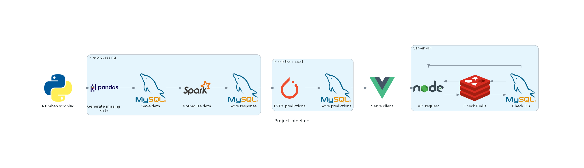

# Long term real estate predictions
This project is part of the course Big Data Technologies at the University of Trento for the academic year 2021/2022. The aim of this project is to make use of various technologies in order to have a system that can predict where a real estate investor should buy to have a profit within 24 months.

The data is scraped from [Numbeo](https://numbeo.com). The starting year is 2017, because before that the data was too small on certain pages.

The predictions are made using an LSTM model. This model has many general uses, and in our case it is used to make predictions on time series data.

## Pipeline

## Requirements
- Python 3.x
- MySQL/MariaDB (make sure the user has remote access)
- Spark
- NodeJS v14+ (only if Docker is not available)
- Docker and Docker Compose

## How to use
- install required python dependencies
- fill the .env file with the correct credentials
- make sure MySQL is started and launch the main.py script
- when it's finished, launch the frontend with `docker-compose up --build` (after the first launch, the build flag can be omitted)
- access the website from http://localhost:8080

## Alternative usage
If the user doesn't have docker, they also need to install NodeJS (preferably version 14). After that, the procedure becomes:
- install required python dependencies
- fill the .env file with the correct credentials
- make sure MySQL is started and launch the main.py script
- when it's finished, move in the API folder and install node dependencies with `npm i`
- fill the .env file with the correct credentials and start the API with `npm run start` or `node index.js`
- move in the frontend folder, install dependencies with `npm i`, start it with `npm run serve`
- access the website from http://localhost:8080

## Data collection and prediction phases
- scrape the data from numbeo
- generate the missing values and store it in the database
- normalize the data, generate the response variable and save it in the database
- pass the data to the LSTM model, make the predictions and store them in the database

## API
The API is used to access two types of storage:
- at first, it checks if the data we requested is available in Redis
- if not, the data is fetched from the database, sent to the client and saved in Redis with an expiry time of 1 hour
- if yes, the data is fetched from Redis and sent to the client

## Frontend
The frontend client is fully responsive and made with VueJS. We wanted to have some interactivity, and the user can:
- visualize a choropleth with the general predictions for the next two years
- click on a country and check the data for all the cities for a given year between 2017 and the current year
- visualize the general investment rating of a country in a year by year plot
All the data is gathered from the API.

## Notes
- the Redis host and Redis port can be used to point to a remote Redis db, for example hosted on [Redis.com](https://Redis.com). If they are left blank, the local Redis installation will be used
- if the database part gives errors somewhere in the python script or node API, make sure that you have a user with remote access enabled. An example on how to do that can be found [here](https://stackoverflow.com/a/16288118)
